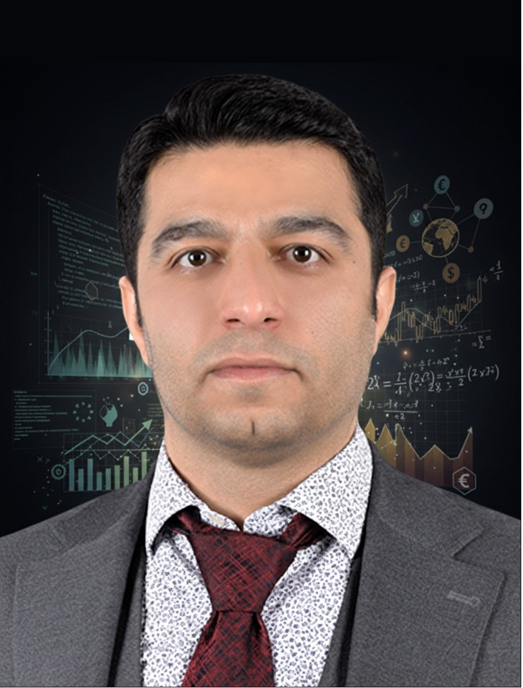

Postdoctoral Research Fellow (Ph.D.)

Shahram Dehghan Jabarabadi

  <a href="https://www.economia.unipd.it/" target="_blank">Department of Economics and Management</a>
  
  <a href="https://www.unipd.it/en/" target="_blank">University of Padua</a>
  
  Padua, Italy

<!-- Bio Section -->

  

    I am a <strong>Postdoctoral Research Fellow</strong> at the <strong>University of Padova</strong>, specializing in the intersection of macro-financial economics, time-series econometrics, and computational text analysis. My research framework leverages advanced programming expertise in <strong>Python, R, and MATLAB</strong> to extract latent economic signals from unstructured data and model systemic risk. My academic foundation includes a Ph.D. in Economics (Statistical Methods) from the <strong>University of Salerno</strong>, complemented by an international visiting research residency at <strong>Justus Liebig University Giessen (Germany)</strong> focused on automated ESG index construction and risk management applications. 
  

  

    Driven by a methodology-first approach, my core capabilities bridge complex quantitative modeling with high-impact applied economic solutions. Currently, I deploy these skills across prominent European research initiatives (including <strong>PRIN-LEXECON, PNRR-GRINS, and PNRR-CHANGE</strong>)  to solve three major data-driven challenges:
  

  <ul>
    <li><strong>Computational NLP & Text Mining:</strong> Designing automated, dictionary-based pipelines, sentiment analysis tools, and multilingual text-coherence indices to quantify institutional frameworks and economic paradigms.</li>
    <li><strong>Advanced Time-Series Econometrics:</strong> Modeling volatility dynamics and measuring financial risk transmission under structural breaks utilizing framework tools like GARCH-MIDAS, BEKK, and CAViaR-X.</li>
    <li><strong>Sustainable Finance & Policy Evaluation:</strong> Constructing novel text-based ESG indicators to evaluate corporate risk, supply chain CO2 reduction, and the linguistic depth of international environmental governance.</li>
  </ul>

<a href="https://scholar.google.com/citations?user=W_Qsf4MAAAAJ&hl=it&oi=ao" class="btn">
    <i class="ai ai-google-scholar"></i> Google Scholar
</a>
<a href="https://orcid.org/0009-0008-4627-7554" class="btn">
    <i class="ai ai-orcid"></i> ORCID
</a>
<a href="mailto:shahram.deghan.j@icloud.com" class="btn">
    <i class="fa-solid fa-envelope"></i> Email
</a>
<a href="mailto:shahram.deghanjabarabadi@unipd.it" class="btn">
    <i class="fa-solid fa-building"></i> Academic Email
</a>

